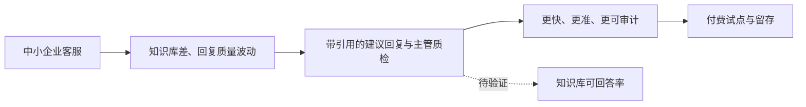
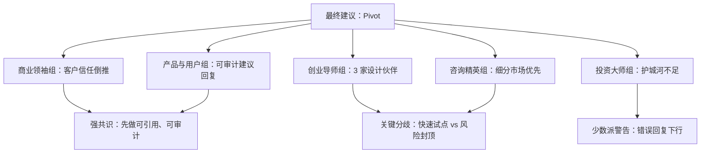
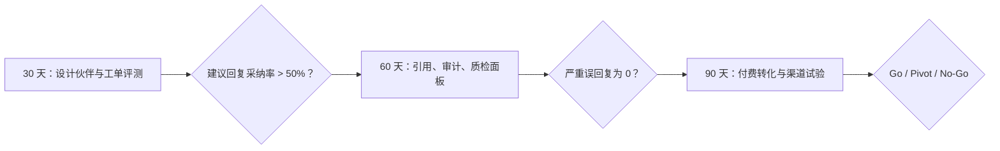

# 《董事会建议书》：中小企业 AI 客服 Copilot

## 输入类型与审议范围

- 输入类型：`business_plan`
- 审议范围：面向中小企业客服团队的 AI Copilot，覆盖知识库检索、回复建议、工单摘要、升级风险提示和主管质检。
- 材料不足说明：缺少试点客户、工单数据质量、客服软件渠道资源、真实付费意愿和合规边界。

## 输入材料结构化拆解

- 目标：验证中小企业愿意为客服效率和质量提升按坐席订阅付费。
- 用户 / 客户：客服一线、客服主管、企业 IT 或老板。
- 当前替代方案：人工查知识库、客服系统内置模板、通用大模型、客服软件已有 AI 功能。
- 商业 / 产品机制：接入知识库和历史工单，提升回复质量、缩短新人上手时间、辅助质检。
- 执行约束：知识库质量参差、合规和品牌风险、数据安全担忧、渠道不确定。

## 价值链 / 工作流图

## 核心假设表

| 假设 | 类型 | 当前证据 | 反证方式 |
|---|---|---|---|
| 中小企业愿意为 AI 客服提效付费 | 商业 | 材料中为市场假设 | 3 家设计伙伴签署付费试点或明确预算 |
| 知识库足以支撑可靠回复 | 产品/技术 | 未提供质量样本 | 抽样 500 条历史工单测试可回答率和幻觉率 |
| 渠道伙伴 CAC 低于直销 | 增长 | 未提供渠道承诺 | 与 2 家客服软件伙伴跑联合销售试验 |

## 一句话结论

建议 Pivot 后推进：不要先卖“AI 客服助手”大而全版本，应先用设计伙伴验证“知识库可引用回复 + 主管质检”这个高信任场景。

## Go / No-Go / Pivot 建议

**建议：Pivot**

理由：需求方向成立，但当前计划同时押注坐席订阅、知识库质量、渠道获客和合规信任，未验证假设过多。第一阶段应收窄为高价值、低风险、可审计的 Copilot，而不是自动回复系统。

## 核心判断

1. 投资大师组认为长期价值取决于数据和工作流嵌入，不在通用回复生成。
2. 产品与用户组认为信任和可审计性是最大产品门槛。
3. 创业导师组认为应先拿 3 家设计伙伴付费试点，再谈渠道规模化。

## 证据强度评级

- 高置信：客服重复问题多、知识库维护差、回复质量波动是常见痛点。
- 中置信：按坐席收费可能可行，主管质检有明确管理价值。
- 低置信 / 待验证：渠道获客更低成本、知识库能支撑高准确率、客户接受数据接入。

## Evidence Packet

| 判断 | 类型 | 证据来源 | 置信度 | 反向证据 | 反证实验 |
|---|---|---|---|---|---|
| 客服知识库分散是真实痛点 | fact | 用户材料描述现状和人工成本 | high | 目标客户已有成熟客服系统 | 访谈 10 家目标客户并记录现有替代方案 |
| 坐席订阅可能匹配价值 | inference | 成本和使用者数量与坐席相关 | medium | 购买者更偏好按工单或知识库计费 | 对三种定价方式做报价测试 |
| 知识库接入能形成防御 | assumption | 工作流嵌入通常提升切换成本 | low | 接入成本高但留存不提升 | 试点 60 天后比较接入深度和留存 |

## Assumption Ledger

| 假设 | 类型 | 当前证据 | 30 天检查 | 60 天检查 | 90 天检查 |
|---|---|---|---|---|---|
| 客服主管愿意付费 | 市场 | 材料给出效率痛点 | 付费访谈 | 报价接受率 | 首批合同 |
| 回复质量能稳定达标 | 技术 | 尚缺真实质检数据 | 小样本质检 | 复杂问题质检 | 客户验收 |
| 获客成本可控 | 财务 | 尚缺渠道数据 | 渠道假设 | CAC 初测 | 回收周期评估 |

## 各委员会结论

### 商业领袖组

共识是产品必须从客户信任倒推，而不是从模型能力出发。Bezos 视角要求先定义客户长期不变需求：更快、更准、更可控；Musk 视角要求拆清幻觉率、响应延迟、知识库覆盖率；Jobs 视角要求让客服一眼看到依据，不要像聊天机器人黑盒；张一鸣视角关注工单和知识反馈能否形成系统；Gerstner 视角要求明确采购、IT、客服主管的责任链。

### 创业导师组

共识是先找 3 家强痛设计伙伴。Paul Graham 视角要求创始团队亲自做客服流程观察；Sam Altman 视角认为若质检和知识库闭环成立，未来可平台化；Reid Hoffman 视角提醒渠道网络只有在产品能提升伙伴价值时才成立；Andreessen 视角认为 AI 能力窗口真实，但市场会快速拥挤；Thiel 视角要求找到防御点：行业知识、工单数据、工作流嵌入或合规能力。

### 投资大师组

共识是通用 AI 回复没有护城河。Buffett 视角要求看净收入留存和低流失；Munger 视角提醒坐席计费可能诱导客户减少坐席、与价值冲突；Taleb 视角要求把错误回复的品牌和合规下行封顶；Soros 视角指出一次严重误回复会改变客户信任预期；Dalio 视角建议区分乐观、基准、投诉高发压力场景。

### 咨询精英组

共识是要先定义目标细分市场和进入策略。Porter 视角指出客服软件、CRM、通用模型和 BPO 都是替代力量；Christensen 视角建议从被现有客服系统忽视的中小企业知识维护任务切入；Bower 视角要求把可审计回复提升为专业服务标准；Henderson 视角建议阶段一只做设计伙伴验证；Gadiesh 视角要求 30 天内交付试点指标。

### 产品与用户组

共识是产品不能直接自动回复客户，第一版应做“带引用依据的建议回复”。Feynman 视角要求每条建议能解释依据；Don Norman 视角要求清晰显示置信度和来源；Marty Cagan 视角把最大风险归为价值风险、可用性风险和商业可行性；Julie Zhuo 视角要求客服、主管、IT 共享质检标准；Naval 视角认为可复利资产是行业知识库和质检数据。

## 董事会审议信号图

## 跨委员会共识

- 第一阶段应收窄到设计伙伴和可审计回复建议。
- 防御来自数据闭环、知识库治理和工作流嵌入，不是生成模型本身。
- 数据安全、错误回复和品牌风险必须先被产品机制处理。
- 渠道策略必须等到价值和集成边界验证后再扩大。

## 关键分歧

- 创业导师组更愿意快速试点，投资大师组要求先限制错误下行。
- 商业领袖组强调客户信任体验，咨询精英组强调市场进入选择。
- 产品与用户组倾向先做质检和建议回复，商业计划原设想更偏坐席 Copilot。

## 委员会质询记录摘要

- Taleb 质询产品组：错误回复导致客户投诉时是否有人工确认和审计链。
- Porter 质询创业组：如果客服软件厂商内置同类功能，独立产品如何定位。
- Munger 质询商业模式：按坐席收费是否与“减少客服工作量”的价值冲突。

## 最大机会

在中小企业客服场景中建立“可引用、可审计、可质检”的 AI 工作层，逐步沉淀行业知识库质量和客服训练数据。

## 最大风险

知识库质量差导致幻觉回复，而产品又没有引用、置信度、权限和人工确认机制，最终造成品牌和合规事故。

## 反证与失败路径

- 3 家设计伙伴不愿提供知识库和工单数据。
- 历史工单抽样中，可可靠回答的问题少于 60%。
- 客服使用后总处理时间没有下降，主管质检负担反而上升。

## 决策条件

- Go 条件：3 家设计伙伴中至少 2 家愿意付费试点，建议回复采纳率超过 50%，严重误回复为 0。
- Pivot 条件：回复生成不稳定，但主管质检和工单摘要价值明确，转向质检 Copilot。
- No-Go 条件：客户拒绝数据接入，或知识库质量导致不可控幻觉。

## 建议行动清单

1. 选择一个垂直行业做 3 家设计伙伴，不要跨行业泛化。
2. 抽样历史工单，先测知识库可回答率、幻觉率、引用命中率。
3. 第一版只做带引用依据的建议回复，不自动发送。
4. 设计权限、审计、脱敏和人工确认机制。
5. 用试点结果重新评估按坐席、按工单量或按质检模块收费。

## 30 / 60 / 90 天行动方案

- 30 天：完成 3 家设计伙伴、500 条工单评测、建议回复原型。
- 60 天：上线知识库引用、权限审计、主管质检面板，验证采纳率。
- 90 天：验证付费转化和渠道伙伴联合销售，决定是否扩行业。

## 30 / 60 / 90 天路线图

## 不建议做什么

- 不建议第一版自动回复客户。
- 不建议同时覆盖多个行业。
- 不建议在价值未验证前押注渠道规模化。

## 需要补充验证的问题

- 客户愿意接入哪些数据，哪些绝对不能接入？
- 客服主管最愿意为回复效率、质检还是新人培训付费？
- 当前客服软件是否开放足够接口？
- 渠道伙伴的激励和分成是什么？
- 哪些错误回复属于不可接受事故？

## 附录：各 Persona 关键意见摘要

25 人合议摘要：商业组聚焦信任和系统化，创业组要求设计伙伴验证，投资组质疑护城河和下行，咨询组由 Porter、Christensen、Bower、Henderson、Gadiesh 共同要求细分市场、利润池、专业标准和一线动作，产品组要求可引用、可审计和人工确认。

## Decision Log Entry

- 决策编号：SB-EXAMPLE-BUSINESS-001
- 创建时间：示例记录
- 审议模式：deep_board_review
- 最终建议：Pivot
- 输入摘要：中小企业客服 AI 助手需要从通用回复转向可审计建议回复。
- 关键假设：客服主管愿意付费、回复质量能稳定达标、获客成本可控。
- 待验证证据：设计伙伴付费意向、复杂问题质检、渠道 CAC。
- 30 天检查点：完成 3 家设计伙伴访谈和报价测试。
- 60 天检查点：完成试点质检和知识库接入评估。
- 90 天检查点：评估是否扩大到渠道销售。
