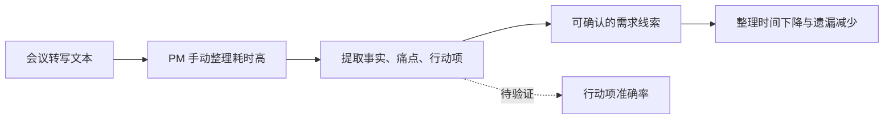
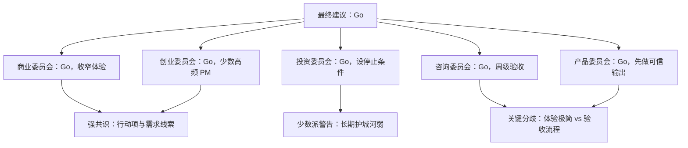
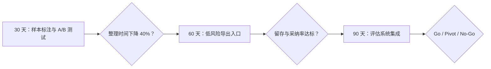

# 《董事会建议书》：AI 会议复盘助手

## 输入类型与审议范围

- 输入类型：`product_requirement`
- 审议范围：内部产品团队 MVP，输入为会议转写文本，输出需求摘要、用户痛点、行动项、负责人建议、优先级理由和待确认问题。
- 材料不足说明：已有会议数量、文本长度和用户担忧，但缺少人工纪要基准、可接受错误率、现有任务流入口和真实输出样本。

## 输入材料结构化拆解

- 目标：两周内把单场会议整理时间从约 45 分钟降到 20 分钟以内，并降低行动项遗漏率。
- 用户 / 客户：一线产品经理、产品负责人、客户成功团队。
- 当前替代方案：人工纪要、通用转写摘要、手动创建任务。
- 商业 / 产品机制：把非结构化会议文本转成可确认、可编辑、可追踪的产品工作项。
- 执行约束：手动上传、内部使用、不接 IM/日历/CRM/任务系统、允许人工编辑。

## 价值链 / 工作流图

## 核心假设表

| 假设 | 类型 | 当前证据 | 反证方式 |
|---|---|---|---|
| PM 愿意手动上传会议文本 | 产品行为 | 材料称 PM 愿意试用 | 10 场真实会议后统计上传完成率和中断原因 |
| AI 输出能显著降低整理时间 | 价值 | 当前人工耗时 35-60 分钟 | A/B 比较人工纪要和 AI 初稿后的总编辑时间 |
| 行动项可以从转写中可靠提取 | 可行性 | 70% 行动项无明确负责人 | 标注 20 份会议，测遗漏率、误判率和需确认比例 |

## 一句话结论

建议继续推进，但第一版必须从“会议总结工具”收窄为“可追溯行动项与需求线索提取器”，并把信任机制放在生成能力之前。

## Go / No-Go / Pivot 建议

**建议：Go**

理由：痛点真实、内部样本足够、两周 MVP 可控；但 Go 的前提是输出必须区分事实、推断和待确认项，并用真实会议样本证明节省时间，而不是只演示漂亮摘要。

## 核心判断

1. Steve Jobs / Don Norman 视角形成强共识：体验关键不是摘要完整，而是用户能一眼判断哪些内容可信、哪些需要确认。
2. Elon Musk / Feynman 视角形成强共识：必须用真实会议样本和可观察指标验证，不接受“看起来不错”的演示。
3. Buffett / Munger / Taleb 视角提醒：长期价值不在通用摘要，而在减少错误成本、沉淀需求资产，并限制幻觉下行。

## 证据强度评级

- 高置信：会议整理耗时高、会议文本样本充足、第一版不接外部系统能降低复杂度。
- 中置信：PM 愿意试用、AI 能节省时间、通用摘要工具不能满足需求闭环。
- 低置信 / 待验证：行动项负责人推断准确率、输出采纳率、手动上传是否能持续。

## 证据包

| 判断 | 类型 | 证据来源 | 置信度 | 反向证据 | 反证实验 |
|---|---|---|---|---|---|
| 会议整理耗时高 | fact | 用户材料给出 35-60 分钟人工耗时 | high | 实际会议复杂度低于样本描述 | 用 10 场真实会议记录人工整理时间 |
| AI 初稿能节省时间 | assumption | 基于会议文本结构化能力推断 | medium | 编辑 AI 初稿比人工整理更慢 | A/B 对比人工纪要与 AI 初稿总耗时 |
| 手动上传不会阻碍试用 | assumption | 材料称 PM 愿意试用 | low | 上传动作导致试点中断 | 观察 10 场会议上传完成率 |

## 假设账本

| 假设 | 类型 | 当前证据 | 30 天检查 | 60 天检查 | 90 天检查 |
|---|---|---|---|---|---|
| PM 愿意持续上传会议文本 | 产品 | 内部 PM 愿意试用 | 上传完成率 | 周活跃使用 | 是否进入团队流程 |
| AI 输出可降低整理时间 | 产品 | 人工耗时高 | 单场节省时间 | 多人复测 | 是否稳定节省 50% |
| 行动项可被可靠提取 | 技术 | 样本中行动项明确度不足 | 标注准确率 | 漏判复盘 | 是否可进入任务系统 |

## 本次审议席位

| 委员会 | 席位代表 | 入选原因 | 证据门槛 | 反证信号 |
|---|---|---|---|---|
| 商业与长期价值委员会 | 沃伦·巴菲特 | 材料涉及长期效率价值和付费可能性。 | 客户付费意愿、留存、单位经济 | 若客户只愿免费试用，则长期价值假设降级。 |
| 产品与用户委员会 | 张小龙 | 材料高度依赖用户信任和默认体验。 | 用户试用路径、编辑行为、持续使用 | 若用户需要大量培训才能使用，则产品化判断降级。 |
| 哲学与人文委员会 | 王阳明 | 方案必须落到行动责任和复盘闭环。 | 行动负责人、现场验证、复盘指标 | 若只有分析没有行动闭环，则建议不能进入 Go。 |

## 各委员会结论

### 商业委员会

强共识是必须把产品主张压缩到一个核心动作：上传会议文本，得到可确认的需求和行动闭环。Jobs 视角要求删掉 IM/日历/CRM 集成，保留可信输出体验；Musk 视角要求先测转写质量和行动项提取边界；Bezos 视角强调长期客户价值是减少遗漏和沉淀客户声音；张一鸣视角认为信息效率提升要能进入团队反馈系统；Gerstner 视角要求 owner 和验收节奏。组内分歧是是否立即设计后续平台化入口，多数意见认为先完成内部闭环。

### 创业委员会

强共识是先服务 5-10 个高频 PM，手工观察他们如何编辑输出。Paul Graham 视角要求证明少数用户强需求；Sam Altman 视角认为若内部高频留存成立，可扩展为产品团队工作流平台；Reid Hoffman 视角关注跨会议知识网络；Andreessen 视角提醒 AI 摘要已经商品化，差异必须来自工作流嵌入；Thiel 视角要求找到非共识防御点。组内少数派警告：如果未来商业化，应尽早记录数据安全和知识沉淀路径。

### 投资委员会

强共识是短期效率价值成立，但长期护城河很弱。Buffett 视角认为通用摘要没有持久商业质量，必须形成需求知识资产；Munger 视角警惕自动化偏误和指标误导；Taleb 视角要求把错误输出的下行封顶；Soros 视角指出早期信任会产生反身性，第一次错误会显著降低采用；Dalio 视角建议建立复盘原则和压力场景。组内倾向是 Go，但必须设定停止条件。

### 咨询委员会

强共识是两周 MVP 需要明确工作包：样本标注、输出规范、评估指标、试点复盘。Porter 视角认为差异化不在“AI 摘要”，而在产品需求管理链路定位；Christensen 视角把用户任务定义为“把会议变成下一步行动”；Bower 视角要求把输出质量提升为产品团队的专业标准；Henderson 视角建议把第一版归为核心效率验证；Gadiesh 视角要求每周节奏和 owner。

### 产品委员会

强共识是最大产品风险是信任。Feynman 视角要求每条输出能回到原文依据；Naval 视角认为可复利资产是需求知识和决策上下文；Don Norman 视角要求状态清晰、错误可恢复；Marty Cagan 视角将最大风险归为价值风险和可用性风险；Julie Zhuo 视角要求产品、设计、工程共享验收标准。建议所有输出分为“原文事实 / 模型推断 / 待确认建议”。

## 席位代表观点

### 沃伦·巴菲特

- 代表观点：如果会议复盘不能沉淀为可持续付费和复购价值，就不能按长期业务判断。
- 证据要求：客户付费意愿、留存、单位经济和客户替代成本。
- 反证提醒：客户只愿免费试用或无法持续使用时，长期价值假设降级。

### 张小龙

- 代表观点：产品化方向应从“服务菜单”收敛为自然、可信、低解释成本的默认路径。
- 证据要求：真实用户试用路径、编辑行为、错误恢复和留存。
- 反证提醒：如果用户需要大量培训或频繁质疑输出，则先降低范围。

### 王阳明

- 代表观点：建议必须进入行动闭环，明确谁验证、在哪里验证、何时复盘。
- 证据要求：行动负责人、现场验证场景、复盘指标和停止条件。
- 反证提醒：只有分析共识但没有行动责任时，不应进入 Go。

## 董事会审议信号图

## 跨委员会共识

- 第一版必须收窄到真实会议文本上的行动项和需求线索提取。
- 信任机制比生成完整性更重要。
- 两周内可以 Go，但必须用真实样本和人工基准验收。
- 长期价值取决于能否沉淀需求资产，而不是一次性纪要。

## 关键分歧

- 创业委员会和商业委员会更愿意先做小闭环；投资委员会更担心长期防御不足。
- 产品委员会要求输出保守可追溯；商业委员会希望体验极简，二者需要在界面上平衡。
- 咨询委员会要求强执行节奏；创业委员会提醒不要过早流程化，避免压低学习速度。

## 委员会质询记录摘要

- Jobs 质询 Gadiesh：两周验收流程是否会让体验变成表格工程，而非产品体验。
- Munger 质询 Marty Cagan：如果行动项准确率作为 KPI，会不会诱导模型输出过多低质量行动项。
- Taleb 质询全体：错误建议被采纳的最大损失是什么，是否有明确人工确认闸门。

## 最大机会

把客户访谈和内部评审从“会后文本”转成可追踪的产品决策资产，长期形成用户痛点、行动闭环和路线图依据。

## 最大风险

AI 把客户原话、PM 推断和模型建议混在一起，用户短期觉得省时间，长期因错误和不可追溯而失去信任。

## 反证与失败路径

- 10 场真实会议试点后，PM 总编辑时间没有下降到 20 分钟以内。
- 行动项遗漏率或误判率高于人工纪要，且修正成本超过节省时间。
- PM 不愿持续手动上传，说明当前入口不适配工作流。

## 决策条件

- Go 条件：20 份真实会议中，平均总整理时间下降 40% 以上，关键行动项遗漏率不高于人工，70% 试点 PM 愿意继续使用。
- Pivot 条件：摘要有价值但行动项不可靠，转向“会议事实检索 + 待确认问题生成”。
- No-Go 条件：用户不愿上传，或错误输出导致 PM 需要重新整理全文。

## 建议行动清单

1. 选取 20 份真实会议转写，人工标注事实、痛点、行动项、负责人和待确认问题。
2. 把输出字段固定为事实摘要、用户痛点、行动项、待确认问题、原文依据。
3. 每条模型推断必须标注来源片段和“需确认”状态。
4. 组织 5 名 PM 进行 10 场会议 A/B 测试。
5. 建立错误分类：遗漏、误判、过度推断、负责人错误、优先级错误。

## 30 / 60 / 90 天行动方案

- 30 天：完成内部 MVP、20 份样本标注、A/B 测试和第一版可信输出规范。
- 60 天：接入一个低风险下游入口，例如导出到 PRD 草稿或任务草稿；建立需求知识库索引。
- 90 天：评估是否接入 IM/日历/任务系统；若留存和准确率达标，再扩到客户成功团队。

## 30 / 60 / 90 天路线图

## 不建议做什么

- 不建议第一版接入 IM、日历、CRM 或任务系统。
- 不建议把负责人和优先级自动写入任务系统。
- 不建议把通用会议摘要作为核心卖点。

## 需要补充验证的问题

- PM 能接受的最大误判率是多少？
- 哪类会议最适合第一版：客户访谈、销售反馈还是内部评审？
- 输出结果最终进入 PRD、任务系统还是知识库？
- 手动上传是否能持续两周以上？
- 哪些客户信息必须脱敏或禁止上传？

## 附录：各 Persona 关键意见摘要

- Steve Jobs：删掉所有非核心集成，把可信行动闭环做漂亮。
- Elon Musk：先测关键路径，不要优化尚未验证的流程。
- Jeff Bezos：客户长期不变需求是少遗漏、省时间、留住客户声音。
- 张一鸣：信息效率提升必须沉淀为团队反馈系统。
- Lou Gerstner：owner、节奏和验收必须明确。
- Paul Graham：亲自服务少数高频 PM，看他们是否持续回来。
- Sam Altman：若内部高频留存成立，可扩成平台。
- Reid Hoffman：长期网络价值来自跨会议知识连接。
- Marc Andreessen：AI 摘要是商品，工作流嵌入才是差异。
- Peter Thiel：必须找到通用工具复制不了的需求资产。
- Warren Buffett：长期商业质量取决于留存和可货币化资产。
- Charlie Munger：警惕自动化偏误和坏 KPI。
- Nassim Taleb：错误输出下行必须封顶。
- George Soros：早期信任会自我强化或自我逆转。
- Ray Dalio：建立原则化复盘和压力场景。
- Michael Porter：定位在需求管理链路，不在会议摘要品类。
- Clayton Christensen：用户雇佣它完成“会议到行动”的任务。
- Marvin Bower：把问题提升到管理层真正关心的客户结果和专业标准。
- Bruce Henderson：判断该工具能否随经验积累降低整理成本并形成组合价值。
- Orit Gadiesh：把战略建议落到一线产品经理明天会改变的动作。
- Richard Feynman：每个输出都要能追溯原文。
- Naval Ravikant：沉淀可复利的需求知识资产。
- Don Norman：让用户看清事实、推断和待确认状态。
- Marty Cagan：先验证价值风险和可用性风险。
- Julie Zhuo：团队必须共享“好输出”的质量标准。

## 决策记录条目

- 决策编号：SB-EXAMPLE-PRODUCT-001
- 创建时间：示例记录
- 审议模式：deep_board_review
- 最终建议：Go
- 输入摘要：AI 会议复盘助手用于把会议转写转为可信行动项和需求线索。
- 关键假设：PM 愿意上传、AI 初稿节省时间、行动项可可靠提取。
- 待验证证据：真实会议 A/B 测试、行动项准确率、持续上传率。
- 30 天检查点：完成样本标注和 A/B 测试。
- 60 天检查点：验证低风险导出入口。
- 90 天检查点：决定是否接入外部系统。
