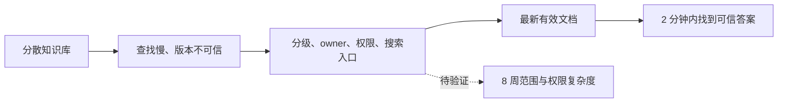
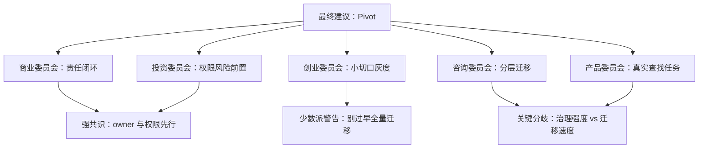
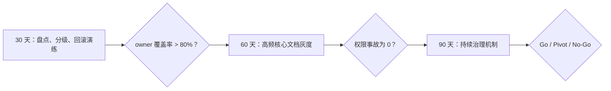

# 《董事会建议书》：企业知识库迁移

## 输入类型与审议范围

- 输入类型：`project_plan`
- 审议范围：8 周内迁移销售、客户成功、研发、产品核心知识库，建立统一目录、权限、搜索入口和归档规则。
- 材料不足说明：缺少文档数量、权限复杂度、旧系统依赖、接口人投入比例和当前查找耗时基线。

## 输入材料结构化拆解

- 目标：核心团队 2 分钟内找到最新有效文档，降低重复和过期文档。
- 用户 / 客户：销售、客户成功、研发、产品、管理层。
- 当前替代方案：多个文档系统并存，人工询问和搜索。
- 商业 / 产品机制：通过统一目录、owner、权限和搜索入口降低查找与误用成本。
- 执行约束：1 名 PM、2 名兼职运营、4 个部门接口人、不能中断日常访问、权限事故为 0。

## 价值链 / 工作流图

## 核心假设表

| 假设 | 类型 | 当前证据 | 反证方式 |
|---|---|---|---|
| 8 周足够完成核心迁移 | 执行 | 有高层目标 | 第 2 周盘点后估算文档量和 owner 缺口 |
| 兼职运营资源足够 | 资源 | 仅 2 名兼职运营 | 样本文档迁移速率测算 |
| 权限模型可在不中断访问下切换 | 风险 | 未提供系统细节 | 灰度权限演练和回滚演练 |

## 一句话结论

建议 Pivot 后推进：目标成立，但计划必须从“迁移所有核心文档”改为“按高价值高风险文档分批迁移，并先建立 owner 与权限闸门”。

## Go / No-Go / Pivot 建议

**建议：Pivot**

理由：8 周目标可作为方向，但当前资源与风险不匹配；权限事故为 0 和不中断访问是硬约束，应先做分级迁移和回滚机制，而不是线性推进。

## 核心判断

1. 咨询委员会和 Lou Gerstner 视角形成强共识：没有 owner 和责任闭环，迁移会变成搬运旧混乱。
2. Taleb / Munger 视角提醒：权限泄露是低概率高损失事件，必须前置处理。
3. 产品委员会提醒：搜索入口和目录必须围绕真实查找任务，而不是组织结构自嗨。

## 证据强度评级

- 高置信：知识分散、重复、过期和权限混乱是明确问题。
- 中置信：统一目录和 owner 能改善查找效率。
- 低置信 / 待验证：8 周能完成核心迁移，兼职资源足够，权限切换零事故。

## 证据包

| 判断 | 类型 | 证据来源 | 置信度 | 反向证据 | 反证实验 |
|---|---|---|---|---|---|
| 迁移阻力主要来自权限和旧入口 | inference | 用户材料列出权限盘点和旧入口约束 | high | 用户真正阻力来自内容质量 | 迁移前访谈各部门 owner |
| 8 周计划可行但缓冲有限 | inference | 材料给出资源和里程碑 | medium | 兼职资源无法覆盖权限异常 | 用首批 50 份文档试迁移测工时 |
| 回滚机制会降低组织阻力 | assumption | 基于迁移项目常见风险控制推断 | low | 用户仍因入口变化抵触 | 灰度组 A/B 观察支持请求量 |

## 假设账本

| 假设 | 类型 | 当前证据 | 30 天检查 | 60 天检查 | 90 天检查 |
|---|---|---|---|---|---|
| 兼职运营足够支撑迁移 | 执行 | 材料列出 2 名兼职运营 | 试迁移工时 | 异常处理量 | 是否需要增援 |
| 权限继承可以准确完成 | 技术 | 尚缺权限样本审计 | 抽样核对 | 部门验收 | 事故复盘 |
| 旧入口可按期下线 | 组织 | 计划中存在下线目标 | 使用量统计 | 灰度下线 | 全量切换 |

## 本次审议席位

| 委员会 | 席位代表 | 入选原因 | 证据门槛 | 反证信号 |
|---|---|---|---|---|
| 商业与长期价值委员会 | 彼得·德鲁克 | 材料涉及组织知识责任、owner 和内部客户。 | 责任人、流程边界、内部客户结果 | 若没有 owner 承担长期维护，则迁移价值降级。 |
| 组织与中国商业实践委员会 | 任正非 | 材料涉及组织承接、长期维护和客户责任。 | 部门责任链、权限治理、持续维护机制 | 若迁移只靠项目组推动，组织能力假设降级。 |
| 哲学与人文委员会 | 孔子 | 材料涉及角色秩序、承诺边界和长期信任。 | 名实一致、角色责任、用户信任 | 若承诺超过实际能力，会损伤内部信任。 |

## 各委员会结论

### 商业委员会

共识是迁移不是文档搬家，而是组织知识责任重构。Bezos 视角要求从内部客户长期需求倒推：找得到、信得过、权限正确；Gerstner 视角要求每类文档 owner 和端到端责任；Jobs 视角要求入口简单，不能让用户理解后台复杂性；张一鸣视角关注信息效率和上下文；Musk 视角要求先测迁移吞吐和权限瓶颈。

### 创业委员会

共识是先做小切口灰度。Paul Graham 视角建议选销售和客户成功中最高频的 50-100 篇文档；Sam Altman 视角认为如果知识入口成功，可扩为企业知识平台；Reid Hoffman 视角关注跨部门知识网络效应；Andreessen 视角提醒不要过早重构所有系统；Thiel 视角要求找到独特控制点：owner、权限和最新版本可信度。

### 投资委员会

共识是下行风险大于表面项目复杂度。Buffett 视角要求看长期维护成本，不只迁移成本；Munger 视角指出激励错配会导致部门把低质量文档甩给项目组；Taleb 视角把权限泄露列为必须封顶风险；Soros 视角提醒一旦用户在新库中找不到文档，信任会快速逆转；Dalio 视角要求压力场景和复盘原则。

### 咨询委员会

共识是计划需要分层：盘点、分级、迁移、灰度、切换。Porter 视角要求区分不同部门知识价值链；Christensen 视角把用户任务定义为“找到最新可信文档”；Bower 视角要求建立文档 owner 的专业责任标准；Henderson 视角建议按核心/邻近/归档组合管理；Gadiesh 视角要求周级吞吐、owner 覆盖率和权限事故指标。

### 产品委员会

共识是用户体验目标不是目录漂亮，而是 2 分钟内找到可信答案。Feynman 视角要求每条规则能被普通员工理解；Don Norman 视角关注搜索、状态和错误恢复；Marty Cagan 视角要求先验证查找任务；Julie Zhuo 视角强调跨部门反馈；Naval 视角认为可复利资产是 owner 清晰的知识系统。

## 席位代表观点

### 彼得·德鲁克

- 代表观点：迁移不是搬文件，而是重新定义知识责任和内部客户结果。
- 证据要求：责任人、流程边界、内部客户结果和维护机制。
- 反证提醒：如果没有 owner 长期维护，迁移只能形成一次性项目成果。

### 任正非

- 代表观点：组织必须能长期承接知识治理，不能只靠项目组冲刺。
- 证据要求：部门责任链、权限治理、持续维护和复盘节奏。
- 反证提醒：如果一线无法持续使用或责任人机制无法建立，组织能力假设降级。

### 孔子

- 代表观点：承诺、角色和事实必须一致，否则会损害内部信任。
- 证据要求：角色责任、承诺边界、用户影响和复盘机制。
- 反证提醒：若上线承诺超过实际能力，应先缩小范围。

## 董事会审议信号图

## 跨委员会共识

- 必须先建立 owner、权限和回滚机制，再大规模迁移。
- 第一批应选择高频、高价值、权限相对清晰的文档。
- 成功指标应包含查找耗时、最新版本信任度、权限事故和 owner 覆盖率。
- 8 周计划需要第 2 周重新定界。

## 关键分歧

- 咨询委员会倾向严格项目治理，创业委员会倾向快速灰度学习。
- 投资委员会要求权限风险前置，商业委员会担心过多控制拖慢迁移。
- 产品委员会强调用户查找任务，项目计划原始结构更偏后台迁移。

## 委员会质询记录摘要

- Taleb 质询项目组：权限事故为 0 的回滚和演练证据在哪里。
- Gerstner 质询所有部门：文档 owner 不明确时谁有权决定废弃。
- Don Norman 质询目录设计：用户找不到文档时如何恢复和反馈。

## 最大机会

把一次迁移项目变成企业知识治理机制：最新版本、owner、权限和搜索入口持续复利。

## 最大风险

在没有 owner 和权限演练的情况下批量迁移，造成错误权限、旧文档误用和用户信任坍塌。

## 反证与失败路径

- 第 2 周盘点后发现 owner 覆盖率低于 60%。
- 样本文档迁移速率显示 8 周无法覆盖核心范围。
- 灰度中发生权限错误或关键文档查找失败。

## 决策条件

- Go 条件：第 2 周完成文档分级，owner 覆盖率超过 80%，权限灰度演练通过。
- Pivot 条件：范围过大时改为销售/客户成功优先迁移。
- No-Go 条件：无法建立权限回滚或部门接口人无法投入。

## 建议行动清单

1. 第 1 周先定义核心文档分级，不做全量搬运。
2. 每篇核心文档必须有 owner、有效期、权限级别和旧入口处理方式。
3. 第 2 周做 50 篇样本文档迁移，测算吞吐和权限复杂度。
4. 第 4 周前完成权限回滚演练。
5. 灰度期间建立“找不到 / 不可信 / 权限错误”反馈入口。

## 30 / 60 / 90 天行动方案

- 30 天：完成盘点、分级、样本迁移、权限模型和回滚演练。
- 60 天：迁移高频核心文档，灰度搜索入口，修正目录和标签。
- 90 天：建立持续治理机制，定期清理过期文档和 owner 变更。

## 30 / 60 / 90 天路线图

## 不建议做什么

- 不建议第一期迁移历史归档和私人笔记。
- 不建议没有 owner 的文档进入核心知识库。
- 不建议在权限模型未演练前正式切换旧入口。

## 需要补充验证的问题

- 当前核心文档总量和部门分布是多少？
- 各部门接口人每周可投入多少小时？
- 哪些文档涉及客户隐私或商业敏感信息？
- 当前查找耗时基线如何测量？
- 旧系统是否支持批量导出和权限映射？

## 附录：各 Persona 关键意见摘要

25 人合议摘要：商业组强调客户倒推和组织责任，创业组建议小切口灰度，投资组前置权限和信任风险，咨询组由 Porter、Christensen、Bower、Henderson、Gadiesh 要求分级治理、责任标准、组合取舍和一线执行，产品组要求围绕真实查找任务设计入口。

## 决策记录条目

- 决策编号：SB-EXAMPLE-PROJECT-001
- 创建时间：示例记录
- 审议模式：deep_board_review
- 最终建议：Pivot
- 输入摘要：企业知识库迁移应先解决 owner、权限和真实查找任务。
- 关键假设：兼职运营足够、权限继承准确、旧入口可按期下线。
- 待验证证据：试迁移工时、权限抽样、旧入口使用量。
- 30 天检查点：完成首批文档试迁移和权限抽样。
- 60 天检查点：完成部门灰度验收。
- 90 天检查点：决定旧入口全量下线或延期。
