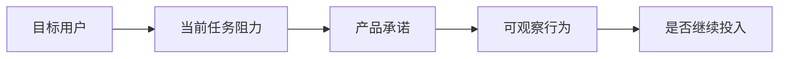

# 《董事会建议书》：产品发现示例

## 输入类型与审议范围

- 输入类型：`product_requirement`
- 审议模式：`product_discovery`
- 审议范围：验证用户任务、价值风险和下一步发现实验。

## 价值链 / 工作流图

## Evidence Packet

| 判断 | 类型 | 证据来源 | 置信度 | 反向证据 | 反证实验 |
|---|---|---|---|---|---|
| 用户任务尚未定义清楚 | inference | 输入材料偏功能描述 | high | 已有访谈能证明任务稳定 | 让用户描述最近一次完成任务的过程 |
| 首版应验证价值风险 | inference | 功能实现前缺少使用证据 | high | 用户已经承诺付费或试用 | 低保真原型测试 |

## Assumption Ledger

| 假设 | 类型 | 当前证据 | 30 天检查 | 60 天检查 | 90 天检查 |
|---|---|---|---|---|---|
| 用户愿意把该任务交给新工具 | 产品 | 尚缺行为证据 | 访谈 | 原型试用 | 留存 |

## 最大机会

如果产品能抓住高频任务并进入现有工作流，会比单点功能更容易形成持续使用。

## 需要补充验证的问题

- 用户现在如何完成该任务？
- 哪一步最耗时或最容易出错？
- 用户愿意放弃哪个现有工具或流程？
- 什么结果会让用户认为“不值得再用”？
