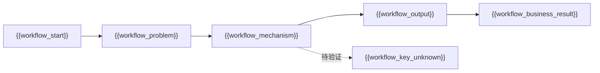
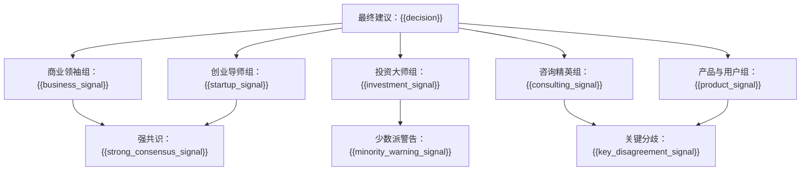
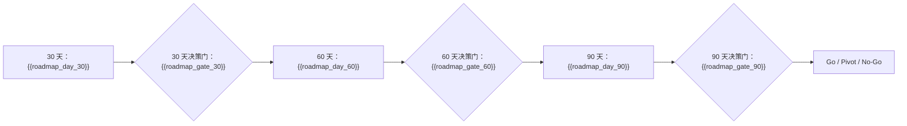

# 《董事会建议书》：{{title}}

## 输入类型与审议范围

- 输入类型：{{input_type}}
- 审议范围：{{scope}}
- 材料不足说明：{{uncertainty_note}}

## 输入材料结构化拆解

- 目标：{{structured_goal}}
- 用户 / 客户：{{structured_users}}
- 当前替代方案：{{structured_alternatives}}
- 商业 / 产品机制：{{structured_mechanism}}
- 执行约束：{{structured_constraints}}

## 价值链 / 工作流图

## 核心假设表

| 假设 | 类型 | 当前证据 | 反证方式 |
|---|---|---|---|
| {{assumption_1}} | {{assumption_1_type}} | {{assumption_1_evidence}} | {{assumption_1_disproof}} |
| {{assumption_2}} | {{assumption_2_type}} | {{assumption_2_evidence}} | {{assumption_2_disproof}} |
| {{assumption_3}} | {{assumption_3_type}} | {{assumption_3_evidence}} | {{assumption_3_disproof}} |

## 一句话结论

{{one_sentence_conclusion}}

## Go / No-Go / Pivot 建议

**建议：{{decision}}**

理由：{{decision_reason}}

## 核心判断

1. {{core_judgment_1}}
2. {{core_judgment_2}}
3. {{core_judgment_3}}

## 证据强度评级

- 高置信：{{high_confidence_evidence}}
- 中置信：{{medium_confidence_evidence}}
- 低置信 / 待验证：{{low_confidence_evidence}}

## 证据包

| 判断 | 类型 | 证据来源 | 置信度 | 反向证据 | 反证实验 |
|---|---|---|---|---|---|
| {{claim_1}} | {{claim_1_type}} | {{claim_1_source}} | {{claim_1_confidence}} | {{claim_1_counterevidence}} | {{claim_1_disproof_test}} |
| {{claim_2}} | {{claim_2_type}} | {{claim_2_source}} | {{claim_2_confidence}} | {{claim_2_counterevidence}} | {{claim_2_disproof_test}} |
| {{claim_3}} | {{claim_3_type}} | {{claim_3_source}} | {{claim_3_confidence}} | {{claim_3_counterevidence}} | {{claim_3_disproof_test}} |

## 假设账本

| 假设 | 类型 | 当前证据 | 30 天检查 | 60 天检查 | 90 天检查 |
|---|---|---|---|---|---|
| {{ledger_assumption_1}} | {{ledger_type_1}} | {{ledger_evidence_1}} | {{ledger_30_1}} | {{ledger_60_1}} | {{ledger_90_1}} |
| {{ledger_assumption_2}} | {{ledger_type_2}} | {{ledger_evidence_2}} | {{ledger_30_2}} | {{ledger_60_2}} | {{ledger_90_2}} |
| {{ledger_assumption_3}} | {{ledger_type_3}} | {{ledger_evidence_3}} | {{ledger_30_3}} | {{ledger_60_3}} | {{ledger_90_3}} |

## 各委员会结论

### 商业领袖组

{{business_leaders_summary}}

### 创业导师组

{{startup_mentors_summary}}

### 投资大师组

{{investment_masters_summary}}

### 咨询精英组

{{consulting_elite_summary}}

### 产品与用户组

{{product_users_summary}}

## 董事会审议信号图

## 跨委员会共识

- {{consensus_1}}
- {{consensus_2}}
- {{consensus_3}}

## 关键分歧

- {{disagreement_1}}
- {{disagreement_2}}
- {{disagreement_3}}

## 委员会质询记录摘要

- {{debate_summary_1}}
- {{debate_summary_2}}
- {{debate_summary_3}}

## 最大机会

{{largest_opportunity}}

## 最大风险

{{largest_risk}}

## 反证与失败路径

- {{failure_path_1}}
- {{failure_path_2}}
- {{failure_path_3}}

## 决策条件

- Go 条件：{{go_condition}}
- Pivot 条件：{{pivot_condition}}
- No-Go 条件：{{no_go_condition}}

## 建议行动清单

1. {{action_1}}
2. {{action_2}}
3. {{action_3}}
4. {{action_4}}
5. {{action_5}}

## 30 / 60 / 90 天行动方案

- 30 天：{{day_30_plan}}
- 60 天：{{day_60_plan}}
- 90 天：{{day_90_plan}}

## 30 / 60 / 90 天路线图

## 不建议做什么

- {{do_not_1}}
- {{do_not_2}}
- {{do_not_3}}

## 需要补充验证的问题

- {{validation_question_1}}
- {{validation_question_2}}
- {{validation_question_3}}
- {{validation_question_4}}
- {{validation_question_5}}

## 附录：各 Persona 关键意见摘要

{{persona_appendix}}

## 决策记录条目

- 决策编号：{{decision_id}}
- 创建时间：{{created_at}}
- 审议模式：{{mode_id}}
- 最终建议：{{decision}}
- 输入摘要：{{decision_input_summary}}
- 关键假设：{{decision_key_assumptions}}
- 待验证证据：{{decision_open_evidence}}
- 30 天检查点：{{decision_checkpoint_30}}
- 60 天检查点：{{decision_checkpoint_60}}
- 90 天检查点：{{decision_checkpoint_90}}
