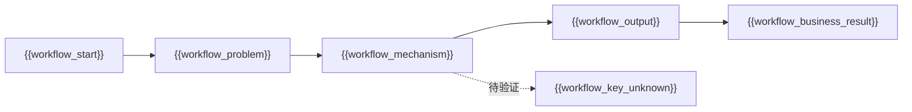
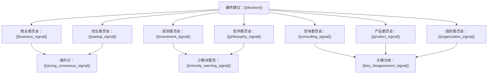
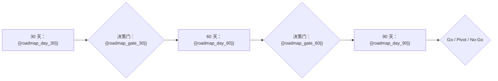

# 《董事会建议书》：{{title}}

## 1. 一页结论

- 输入类型：{{input_type}}
- 审议范围：{{scope}}
- 一句话结论：{{one_sentence_conclusion}}
- 当前建议：{{decision}}
- 材料不足说明：{{uncertainty_note}}

## 2. 输入材料与审议范围

- 材料文件数：{{material_file_count}}
- 可引用来源块数：{{source_block_count}}
- 来源块说明：来源块是材料文件拆分后的可引用文本片段，不代表不同文件；报告中不得把多个来源块表述成多个材料文件。
- 目标：{{structured_goal}}
- 用户 / 客户：{{structured_users}}
- 当前替代方案：{{structured_alternatives}}
- 商业 / 产品机制：{{structured_mechanism}}
- 执行约束：{{structured_constraints}}

## 3. 本次审议席位

> 只列出本次实际进入审议的常驻代表和触发专家；未启用或未触发的席位不需要展示。

| 委员会 | 席位代表 | 入选原因 | 证据门槛 | 反证信号 |
|---|---|---|---|---|
| {{seat_committee_1}} | {{seat_display_name_1}} | {{seat_reason_1}} | {{seat_evidence_basis_1}} | {{seat_counter_signal_1}} |
| {{seat_committee_2}} | {{seat_display_name_2}} | {{seat_reason_2}} | {{seat_evidence_basis_2}} | {{seat_counter_signal_2}} |
| {{seat_committee_3}} | {{seat_display_name_3}} | {{seat_reason_3}} | {{seat_evidence_basis_3}} | {{seat_counter_signal_3}} |

## 4. Go / No-Go / Pivot 建议

**建议：{{decision}}**

- 推荐理由：{{decision_reason}}
- Go 条件：{{go_condition}}
- Pivot 条件：{{pivot_condition}}
- No-Go 条件：{{no_go_condition}}

## 5. 核心判断依据

1. {{core_judgment_1}}（证据：{{core_judgment_1_evidence_id}}）
2. {{core_judgment_2}}（证据：{{core_judgment_2_evidence_id}}）
3. {{core_judgment_3}}（证据：{{core_judgment_3_evidence_id}}）

> 正文只引用证据编号，来源摘录集中放在附录 A。

### 本体触发与规则链

| 委员会 | 本体人物 | 触发规则 | 触发材料 | 证据缺口 | 反证实验 |
|---|---|---|---|---|---|
| {{ontology_committee_1}} | {{ontology_persona_1}} | {{ontology_rule_1}} | {{ontology_trigger_1}} | {{ontology_missing_evidence_1}} | {{ontology_counter_test_1}} |
| {{ontology_committee_2}} | {{ontology_persona_2}} | {{ontology_rule_2}} | {{ontology_trigger_2}} | {{ontology_missing_evidence_2}} | {{ontology_counter_test_2}} |
| {{ontology_committee_3}} | {{ontology_persona_3}} | {{ontology_rule_3}} | {{ontology_trigger_3}} | {{ontology_missing_evidence_3}} | {{ontology_counter_test_3}} |

## 6. 委员会意见

### 商业与长期价值委员会

{{business_leaders_summary}}

### 创业与非共识机会委员会

{{startup_mentors_summary}}

### 投资与风险委员会

{{investment_masters_summary}}

### 战略与竞争委员会

{{consulting_elite_summary}}

### 产品与用户委员会

{{product_users_summary}}

### 组织与中国商业实践委员会

{{organization_china_summary}}

### 哲学与人文委员会

{{philosophy_humanities_summary}}

## 7. 席位代表观点

### {{seat_display_name_1}}

- 代表观点：{{seat_viewpoint_1}}
- 证据要求：{{seat_evidence_requirement_1}}
- 反证提醒：{{seat_counter_reminder_1}}

### {{seat_display_name_2}}

- 代表观点：{{seat_viewpoint_2}}
- 证据要求：{{seat_evidence_requirement_2}}
- 反证提醒：{{seat_counter_reminder_2}}

### {{seat_display_name_3}}

- 代表观点：{{seat_viewpoint_3}}
- 证据要求：{{seat_evidence_requirement_3}}
- 反证提醒：{{seat_counter_reminder_3}}

## 8. 跨委员会共识与关键分歧

**强共识**

- {{consensus_1}}
- {{consensus_2}}
- {{consensus_3}}

**关键分歧**

- {{disagreement_1}}
- {{disagreement_2}}
- {{disagreement_3}}

## 9. 最大机会、最大风险与反证路径

- 最大机会：{{largest_opportunity}}
- 最大风险：{{largest_risk}}
- 最强反证：{{strongest_counterargument}}
- 失败路径 1：{{failure_path_1}}
- 失败路径 2：{{failure_path_2}}
- 失败路径 3：{{failure_path_3}}

## 10. 30 / 60 / 90 天行动计划

| 时间 | 行动 | 负责人 | 验收证据 |
|---|---|---|---|
| 30 天 | {{day_30_plan}} | {{day_30_owner}} | {{day_30_evidence}} |
| 60 天 | {{day_60_plan}} | {{day_60_owner}} | {{day_60_evidence}} |
| 90 天 | {{day_90_plan}} | {{day_90_owner}} | {{day_90_evidence}} |

## 附录 A：证据包

| 编号 | 判断 | 类型 | 证据来源 | 置信度 | 反向证据 | 反证实验 |
|---|---|---|---|---|---|---|
| E1 | {{claim_1}} | {{claim_1_type}} | {{claim_1_source}} | {{claim_1_confidence}} | {{claim_1_counterevidence}} | {{claim_1_disproof_test}} |
| E2 | {{claim_2}} | {{claim_2_type}} | {{claim_2_source}} | {{claim_2_confidence}} | {{claim_2_counterevidence}} | {{claim_2_disproof_test}} |
| E3 | {{claim_3}} | {{claim_3_type}} | {{claim_3_source}} | {{claim_3_confidence}} | {{claim_3_counterevidence}} | {{claim_3_disproof_test}} |

## 附录 B：待验证假设

| 假设 | 类型 | 当前证据 | 30 天检查 | 60 天检查 | 90 天检查 |
|---|---|---|---|---|---|
| {{ledger_assumption_1}} | {{ledger_type_1}} | {{ledger_evidence_1}} | {{ledger_30_1}} | {{ledger_60_1}} | {{ledger_90_1}} |
| {{ledger_assumption_2}} | {{ledger_type_2}} | {{ledger_evidence_2}} | {{ledger_30_2}} | {{ledger_60_2}} | {{ledger_90_2}} |
| {{ledger_assumption_3}} | {{ledger_type_3}} | {{ledger_evidence_3}} | {{ledger_30_3}} | {{ledger_60_3}} | {{ledger_90_3}} |

## 附录 C：Persona 关键意见摘要

{{persona_appendix}}

### 本体边界说明

- 核心董事：{{core_ontology_personas}}
- 按需触发专家：{{triggered_specialists}}
- 归档蒸馏档案：{{distilled_archive_personas}}
- 本体未覆盖或证据不足的判断：{{ontology_gaps}}

## 附录 D：决策记录

- 决策编号：{{decision_id}}
- 创建时间：{{created_at}}
- 审议模式：{{mode_id}}
- 最终建议：{{decision}}
- 输入摘要：{{decision_input_summary}}
- 关键假设：{{decision_key_assumptions}}
- 待验证证据：{{decision_open_evidence}}
- 30 天检查点：{{decision_checkpoint_30}}
- 60 天检查点：{{decision_checkpoint_60}}
- 90 天检查点：{{decision_checkpoint_90}}
